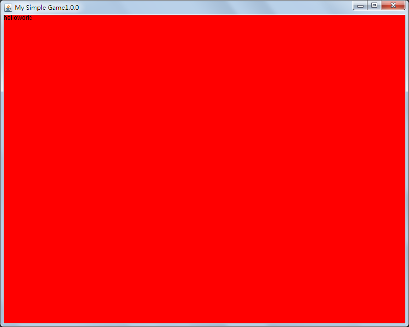

# SimpleGameTutorial
这是一个简易的Java游戏制作教程。大部分的内容参考自[CSDN](https://blog.csdn.net/XcantloadX/article/details/87731020)

本教程每一章都会用tags来标记。

## 第一章：画出HelloWorld
我们首先创建Main类和Game类。Game类继承JFrame类。

Main类：

    package io.github.squid233.sgt;
    
    import io.github.squid233.sgt.engine.Game;

    /**
     * @author squid233
     */
    public class Main {
        public static void main(String[] args) {
            new Game();
        }
    }

Game类：

    package io.github.squid233.sgt.engine;
    
    import javax.swing.*;
    
    /**
     * @author squid233
     */
    public class Game extends JFrame {
    
        private static final String VERSION = "1.0.0";
    
        public Game() {
            setSize(800, 640);
            setDefaultCloseOperation(JFrame.EXIT_ON_CLOSE);
            setTitle("My Simple Game" + VERSION);
            setVisible(true);
        }
    
    }

其中`VERSION`可以更改为其它版本。

由于做的是游戏，不可能用Java自带的控件来做，那样效率很低，所以需要重写paint方法，自己来画。  
将Game类修改如下：

    package io.github.squid233.sgt.engine;
    
    import javax.swing.*;
    import java.awt.*;
    
    /**
     * @author squid233
     */
    public class Game extends JFrame {

        private static final String VERSION = "1.0.0";

        public static final int BORDER_TOP_SIZE = 39;
        public static final int BORDER_SIDE_SIZE = 7;

        public Game() {
            init();
        }

        /**
         * 初始化窗口
         */
        public void init() {
            setSize(800, 640);
            setDefaultCloseOperation(JFrame.EXIT_ON_CLOSE);
            setTitle("My Simple Game" + VERSION);
            setVisible(true);
        }

        @Override
        public void paint(Graphics g) {
            g.setColor(Color.RED);
            g.fillRect(0, 0, getWidth(), getHeight());
            g.setColor(Color.BLACK);
            g.drawString("helloworld",  BORDER_SIDE_SIZE, BORDER_TOP_SIZE);
        }
    }

注意画文字的时候有个坑，坐标不要设置太小了，要不然会画在窗口外面，看不到。

效果图：  

