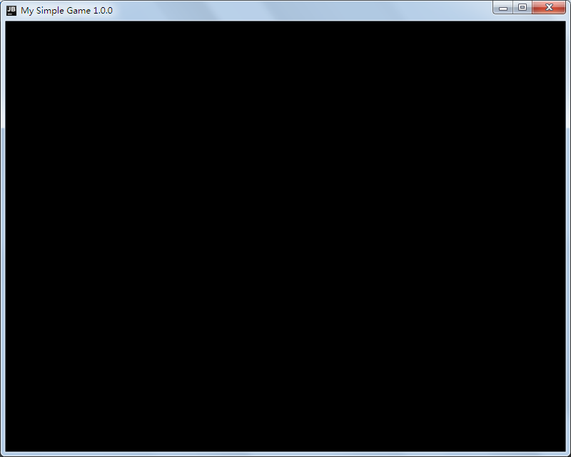
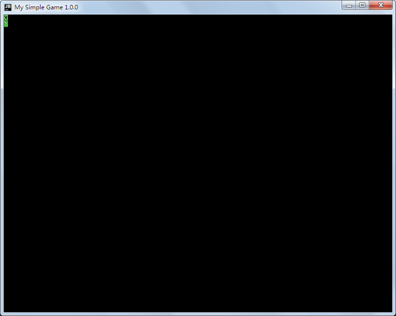

# SimpleGameTutorial

这是一个简易的Java游戏制作教程。大部分的内容参考自[CSDN](https://blog.csdn.net/XcantloadX/article/details/87731020)

本教程每一章都会用tags来标记。

## 第一章：画出HelloWorld
我们首先创建Main类和Game类。Game类继承JFrame类。

Main类：

    package io.github.squid233.sgt;
    
    import io.github.squid233.sgt.engine.Game;

    /**
     * @author squid233
     */
    public class Main {
        public static void main(String[] args) {
            new Game();
        }
    }

Game类：

    package io.github.squid233.sgt.engine;
    
    import javax.swing.*;
    
    /**
     * @author squid233
     */
    public class Game extends JFrame {
    
        private static final String VERSION = "1.0.0";
    
        public Game() {
            setSize(800, 640);
            setDefaultCloseOperation(JFrame.EXIT_ON_CLOSE);
            setTitle("My Simple Game" + VERSION);
            setVisible(true);
        }
    
    }

其中`VERSION`可以更改为其它版本。

由于做的是游戏，不可能用Java自带的控件来做，那样效率很低，所以需要重写paint方法，自己来画。  
将Game类修改如下：

    package io.github.squid233.sgt.engine;
    
    import javax.swing.*;
    import java.awt.*;
    
    /**
     * @author squid233
     */
    public class Game extends JFrame {

        private static final String VERSION = "1.0.0";

        public static final int BORDER_TOP_SIZE = 39;
        public static final int BORDER_SIDE_SIZE = 7;

        public Game() {
            init();
        }

        /**
         * 初始化窗口
         */
        public void init() {
            setSize(800, 640);
            setDefaultCloseOperation(JFrame.EXIT_ON_CLOSE);
            setTitle("My Simple Game" + VERSION);
            setVisible(true);
        }

        @Override
        public void paint(Graphics g) {
            g.setColor(Color.RED);
            g.fillRect(0, 0, getWidth(), getHeight());
            g.setColor(Color.BLACK);
            g.drawString("helloworld",  BORDER_SIDE_SIZE, BORDER_TOP_SIZE);
        }
    }

注意画文字的时候有个坑，坐标不要设置太小了，要不然会画在窗口外面，看不到。

效果图：  

## 第二章：画出一只苦力怕
为了更好地管理游戏，目前的框架是这样的：

Game：游戏的核心类，储存多个GameObject，处理游戏的渲染、输入等  
GameObjectWithTexture：一个显示出贴图的预制GameObject  
GameObject：最基本的类，游戏主要的逻辑处理

---
新建类GameObject，所有的游戏物体都会继承此类

    package io.github.squid233.sgt.obj;
    
    import java.awt.Graphics;
    
    /**
     * @author squid233
     */
    public class GameObject {
        /** 坐标x */
        protected int x;
        /** 坐标y */
        protected int y;
    
        /**
         * 渲染此GameObject
         *
         * @param g 目标Graphics
         */
        public void draw(Graphics g) {
    
        }
    
        /**
         * 设置坐标
         */
        public void setPosition(int x, int y) {
            setX(x);
            setY(y);
        }
    
        /**
         * 移动指定偏移坐标
         */
        public void transfer(int x, int y) {
            this.x += x;
            this.y += y;
        }
    
        public int getX() {
            return x;
        }
    
        public void setX(int x) {
            this.x = x;
        }
    
        public int getY() {
            return y;
        }
    
        public void setY(int y) {
            this.y = y;
        }

    }

再新建一个类GameObjectWithTexture(伴随着材质的GameObject)继承GameObject，重写draw方法

    package io.github.squid233.sgt.obj;
    
    import java.awt.Graphics;
    import java.awt.Image;
    import java.awt.Toolkit;
    
    /**
     * @author squid233
     */
    public class GameObjectWithTexture extends GameObject {
    
        private Image image;
    
        public GameObjectWithTexture(String filePath) {
            //从文件里加载图片
            image = Toolkit.getDefaultToolkit().createImage(filePath);
            this.x = 0;
            this.y = 0;
        }
    
        @Override
        public void draw(Graphics g) {
            //在(x,y)处绘制图片，不拉伸，原图片多大，画出来就多大
            g.drawImage(image, x, y, null);
        }
    
        public Image getImage() {
            return image;
        }
    
        public void setImage(Image image) {
            this.image = image;
        }
    }
---
为了能储存当前所有的GameObject，在Game类下创建一个ArrayList  
`private final ArrayList<GameObjectWithTexture> gameObjects;`

修改构造方法

    public Game() {
        //初始化ArrayList
        gameObjects = new ArrayList<>();
        init();
    }

添加addGameObject方法

    public void addGameObject(GameObjectWithTexture gameObject) {
        gameObjects.add(gameObject);
    }

在paint方法里需要遍历list，调用所有GameObject的draw方法，这样就能把所有的物体都显示出来

    @Override
    public void paint(Graphics g) {
        g.setColor(Color.BLACK);
        g.fillRect(0, 0, getWidth(), getHeight());
        for (GameObjectWithTexture gameObject : gameObjects) {
            gameObject.draw(g);
        }
    }

这里提供一个素材（来自Minecraft）：

修改main方法，加入一个GameObjectWithTexture

    Game game = new Game();
    GameObjectWithTexture creeper = new GameObjectWithTexture("img/creeper.png");
    creeper.setPosition(Game.BORDER_SIDE_SIZE, Game.BORDER_TOP_SIZE);
    game.addGameObject(creeper);

运行一下，效果图：  
  
好像什么效果都没有？  
仔细查看代码，在创建Game对象的时候就已经创建了窗口

创建了之后窗口就要显示出来，paint方法会立即被调用，而此时GameObjectWithTexture还没有创建，所以什么都没有

现在将窗口最小化，再恢复，你会发现GameObjectWithTexture又显示出来了：  

因为窗口的状态被改变了，系统就通知窗口重画了一遍，所以GameObjectWithTexture显示了出来  
显然游戏不能这样，这是下一章里要解决的

## 第三章：渲染线程/让Creeper动起来

针对上次的只有更新窗口时画面才会重画，解决方法很简单：  
只需要新建一个线程，隔一段时间就通知游戏窗口重画，不停的在窗口上重画，看起来就好像是动态的画面，实质上只是静态的图片。

隔多久呢？  
一般的2D游戏的帧数在20-30fps左右。

什么是帧/FPS：  
**帧(Frame)**：画在游戏窗口上的一张静态图  
**帧速率(FPS/帧数)**：静态图片更新速度的快慢（FPS = 1秒 / 1秒内渲染的帧数）

---
首先修改Game类，添加以下代码：

    //.....
    /**
     * 游戏的FPS
     */
    private int fps;
    //.....

    //.....

    /**
     * 退出游戏
     */
    public void exit() {
        System.exit(-1);
    }

    /**
     * 返回游戏的FPS
     */
    public int getFps() {
        return fps;
    }

    /**
     * 设置游戏的FPS
     *
     * @param fps 新FPS
     * @return 是否设置成功
     */
    public boolean setFps(int fps) {
        if (fps <= 0) {
            return false;
        } else {
            this.fps = fps;
            return true;
        }
    }
    //.....

新建类RenderThread，用来定时重画窗口：

    package io.github.squid233.sgt.engine;
    
    /**
     * @author squid233
     */
    public class RenderThread implements Runnable {
        private Thread thread;
        /** 游戏是否退出 */
        private boolean exited = false;
        /** 每次绘制隔多久 */
        private final int interval;
        public Game game;
    
        public RenderThread(Game g) {
            game = g;
            //计算出隔多久重画一次(毫秒)
            interval = 1000 / game.getFps();
            System.out.println("[RenderThread]Created");
            System.out.println("[RenderThread]Render interval: " + interval + " ms");
        }
    
        @Override
        public void run() {
            System.out.println(thread.getName() + "Start rendering");
            while (!exited) {
                game.repaint();//通知游戏窗口重画
                try {
                    //间隔一定时间渲染一次，来实现稳定fps
                    Thread.sleep(interval);
                } catch (Exception e) {
                    System.out.println(thread.getName() + "Error: " + e.toString());
                    exited = true;
                }
            }
            System.out.println(thread.getName() + "Stop rendering");
            game.exit();
        }
    
        public void start() {
            if (thread == null) {
                thread = new Thread(this, "[RenderThread]");
                thread.start();
            }
        }
    
    }

在启动游戏的同时启动渲染线程：

    public Game() {
        setFps(30);
        //初始化ArrayList
        gameObjects = new ArrayList<>();
        init();
        //初始化线程
        RenderThread render = new RenderThread(this);
        //启动线程
        render.start();
    }

启动游戏，看看效果：  

可以看到不需要刷新窗口就能显示出来  
下面让Creeper动起来，以便更好地观察效果

---
修改GameObject类，添加onTick方法，这个方法会在游戏渲染每一帧的时候被调用：

    /**
	 * 在游戏的每帧被调用
	 */
	public void onTick() {

	}

下面为了修改让这个方法有实际用途，创建类Creeper继承GameObjectWithTexture，就可以重写onTick方法：

    package io.github.squid233.sgt.obj;
    
    /**
     * @author squid233
     */
    public class Creeper extends GameObjectWithTexture {
    
        public Creeper(String filePath) {
            super(filePath);
        }
    
        @Override
        public void onTick() {
            //在当前位置的基础上向右移动1个单位长度
            this.transfer(1, 0);
        }
    }

修改Main方法：

    Game game = new Game();
    Creeper creeper = new Creeper("img/creeper.png");
    creeper.setPosition(Game.BORDER_SIDE_SIZE, Game.BORDER_TOP_SIZE);
    game.addGameObject(creeper);

启动游戏，好像还是没效果？  

因为onTick方法还没有被调用！  
修改一下Game类，调用onTick方法：

    /**
     * 重写窗体绘制方法
     * @param g graphics
     */
    @Override
    public void paint(Graphics g) {
        g.setColor(Color.BLACK);
        g.fillRect(0, 0, getWidth(), getHeight());
        //渲染所有的game object
        for (GameObjectWithTexture gameObject : gameObjects) {
            gameObject.onTick();
            gameObject.draw(g);
        }
    }

再运行一次就可以看到creeper移动了。  
但是出现了闪烁现象，这是下一次要解决的。
